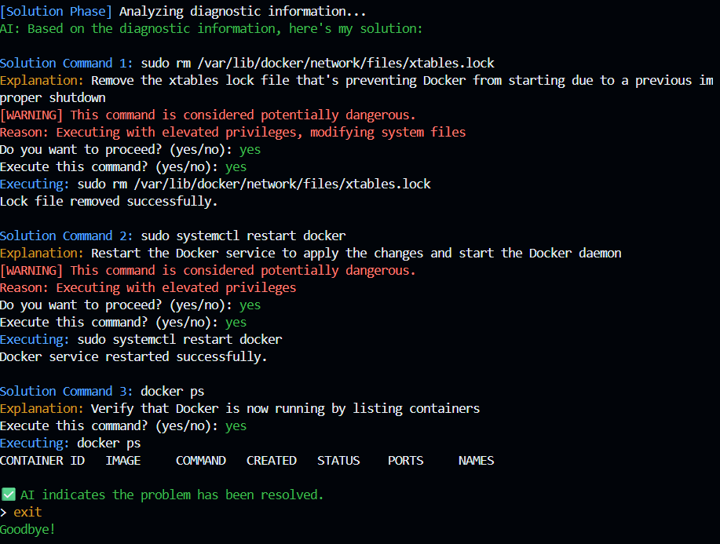

# 🧠 System-Aware AI CLI Assistant

A smart command-line tool that connects your system with an AI safely. It diagnoses system issues and suggests step-by-step command fixes, **without risking system stability**.

> ⚠️ All commands are confirmed by the user before execution. High-risk commands are flagged with a warning.



---

## ✨ Features

* Understands user system issues (e.g. "Docker not working").
* AI dynamically requests relevant system info.
* Gathers required data and sends to AI.
* Receives step-by-step fix instructions.
* Executes commands with user approval.
* Supports both OpenAI and Google Gemini APIs.
* Intelligent command parsing (handles quoted arguments properly).
* Color-coded terminal output for better readability.
* Enhanced safety features with detailed warnings.
* Improved command output formatting.
* Interrupts and handles errors safely.
* Command timeout protection.
* Auto-correction of model names.
* Comprehensive dangerous command detection.
* Purpose explanations for diagnostic commands.
* Better handling of shell operators (pipes, redirects).

---

## 📦 Tech Stack

| Component     | Technology                               |
| ------------- | ---------------------------------------- |
| Language      | Java                                     |
| CLI Framework | [Picocli](https://picocli.info) or JLine |
| AI Backend    | OpenAI API, Google Gemini API            |
| Command Exec  | Java ProcessBuilder                      |
| Config        | JSON or SQLite (optional)                |
| Deployment    | GitHub Codespaces / Local                |

---

## 🚀 Getting Started

### 🔧 Prerequisites

* Java 17+
* Git
* OpenAI API Key
* (Optional) Docker, Node, or other tools to test commands

---

### 🛠 Setup Instructions (Maven)

```bash
# 1. Clone the repo
git clone https://github.com/yourusername/system-ai-cli.git
cd system-ai-cli

# 2. Add your OpenAI key
echo "OPENAI_API_KEY=your-key-here" > .env

# 3. Build the CLI (production JAR)
mvn clean package

# 4. Run the CLI
java -jar target/system-ai-cli-1.0.0.jar --help
```

> You can run this in **GitHub Codespaces** too (Java Dev Container preset).

---

### 🛠 Installation (Global Command)

To use the CLI as a global command (`sysai`) from anywhere on your system:

```bash
# 1. Build the JAR (if not already done)
mvn clean package

# 2. Copy the JAR to a standard location (e.g., /usr/local/lib)
sudo mkdir -p /usr/local/lib
sudo cp target/system-ai-cli-1.0.0.jar /usr/local/lib/

# 3. Create a wrapper script in /usr/local/bin
sudo bash -c 'cat > /usr/local/bin/sysai <<EOF
#!/bin/bash
java -jar /usr/local/lib/system-ai-cli-1.0.0.jar "$@"
EOF'

# 4. Make the script executable
sudo chmod +x /usr/local/bin/sysai
```

Now you can run the CLI from anywhere using:

```bash
sysai "docker not working"
```

> You can uninstall by removing `/usr/local/bin/sysai` and `/usr/local/lib/system-ai-cli-1.0.0.jar`.

---

## 🧪 Usage

```bash
$ java -jar target/system-ai-cli-1.0.0.jar "docker not working"
```

### 🧠 How it works:

1. You type a system problem in natural language.
2. AI replies with info it needs (e.g., docker logs).
3. CLI collects this info and sends it back.
4. AI returns step-by-step commands to fix.
5. CLI confirms and runs them one-by-one.

---

## 🧑‍💻 Interactive Usage Flow & Configuration

When you start the CLI for the first time, you will:
1. Choose your AI provider (e.g., OpenAI, Gemini).
2. Enter the model name (e.g., gpt-4, gemini-pro).
3. Enter your API key.

These details are saved in a config file (`~/.sysai_config.json`). On future runs, you will not be prompted again unless you type `change` to update your provider/model/API key.

Example session:

```
$ sysai
Welcome to System-Aware AI CLI Assistant!
Current provider: OpenAI, model: gpt-4
Type 'change' to update provider/model/API key, or 'exit' to quit.
> docker not working
AI: [Simulated OpenAI/gpt-4] You asked: 'docker not working' (API key: sk-***)
> change
Choose your AI provider:
1. OpenAI
2. Gemini
Enter choice [1-2]: 2
Enter model name (e.g., gpt-4, gemini-pro): gemini-pro
Enter API key: gem-...
Current provider: Gemini, model: gemini-pro
> exit
Goodbye!
```

---

## 🛡️ Safety Features

* All commands must be **explicitly approved**.
* AI commands are **filtered** for danger (`rm`, `dd`, etc.).
* User is warned before any risky execution.
* Errors pause the execution with choices (retry/skip/abort).
* Logging is done for every session.

---

## 🔄 AI Backend Flexibility

This CLI can support any AI backend if the request/response can be configured and structured properly. Profiles will be available to support popular AIs such as Gemini, ChatGPT, and more. You can extend or add new profiles for additional AI providers as needed.

---

## 📁 Project Structure

```bash
system-ai-cli/
│
├── src/
│   └── main/
│       └── java/
│           ├── cli/         # Entry point and command line parsing
│           ├── ai/          # Handles interaction with AI backends
│           ├── system/      # Executes and logs system commands
│           └── safety/      # Checks risk level of commands
│
├── .env                     # API key config
├── pom.xml                  # Maven build file
├── target/                  # Compiled output and JARs