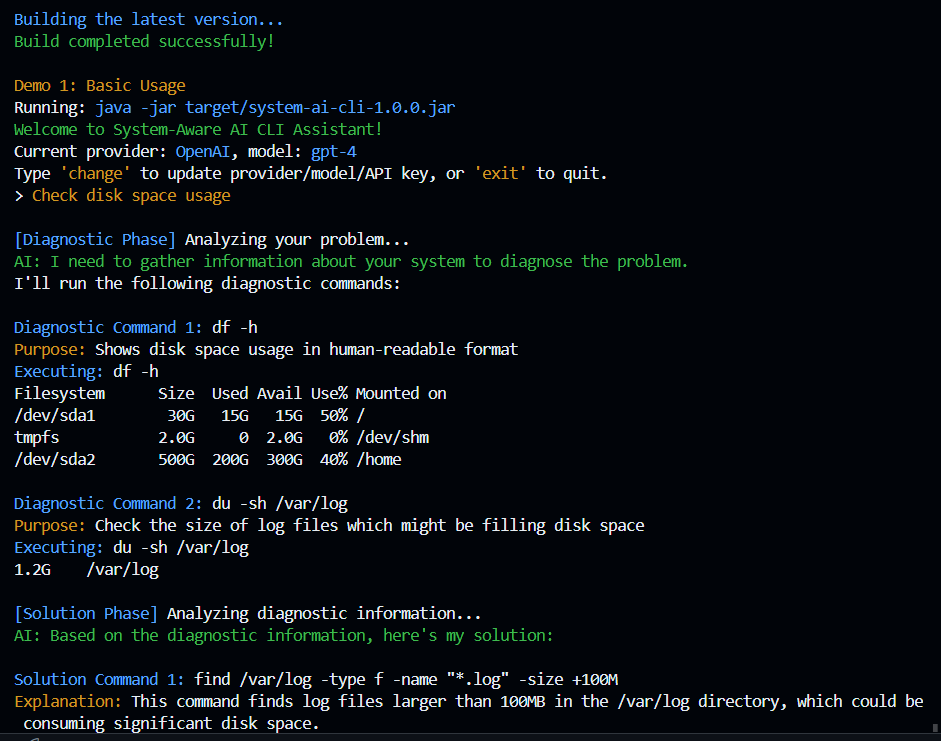
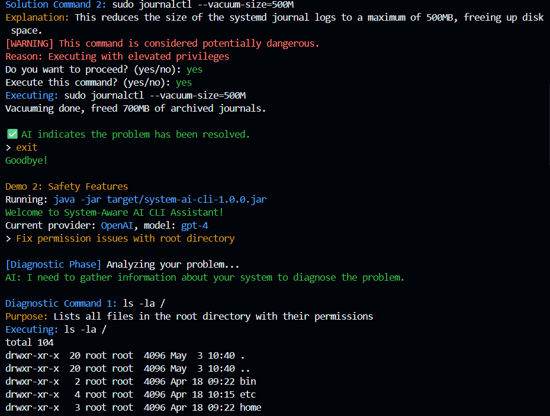

# System-Aware AI CLI Assistant

A production-ready Java CLI tool that connects to AI providers (OpenAI, Gemini, etc.), lets users select provider/model/API key, accepts natural language queries, receives AI-generated step-by-step system commands, checks command safety, prompts for user approval, executes/logs commands, and is installable as a global command.

## Features
- Interactive CLI for natural language system queries
- Supports multiple AI providers (OpenAI, Gemini, etc.)
- Persistent configuration in `~/.sysai_config.json`
- Enhanced diagnostic capabilities with purpose explanations
- Color-coded terminal output for better readability
- Safety checks for dangerous system commands with detailed explanations
- User approval before executing commands
- Command output formatting and truncation
- Logs command output to the console
- JUnit tests for core components
- GitHub Actions pipeline for CI/CD



## Getting Started

### Prerequisites
- Java 17+
- Maven 3.6+

### Build the Project

```
git clone <your-repo-url>
cd CLI-AI
mvn clean package
```

The built JAR will be in `target/system-ai-cli-1.0.0-shaded.jar`.

### Run the CLI

```
java -jar target/system-ai-cli-1.0.0-shaded.jar
```

### First Run Setup
- On first run, you'll be prompted to select an AI provider, model, and enter your API key.
- This configuration is saved in `~/.sysai_config.json` for future runs.

### Usage
- Type your natural language query (e.g., "List files in this directory").
- The AI will enter the **Diagnostic Phase** where it suggests system commands to gather information.
- For each diagnostic command, you'll see:
  - The command to run
  - Its purpose/explanation
  - A safety warning if applicable (with detailed reason)
  - Option to approve or skip
- After gathering diagnostic information, the AI enters the **Solution Phase**.
- It will suggest solution commands based on the diagnostic results.
- Each solution command includes:
  - The command to run
  - A detailed explanation of what it does
  - Option to approve or skip
- The AI will indicate whether the problem is resolved or not.
- Type `change` to update provider/model/API key.
- Type `exit` to quit.

## Example Screenshots

### Diagnostic Phase


### Solution Phase with Safety Warnings


### Full Workflow Example


### Gemini API Usage
When using Google's Gemini API:
- You'll need a valid API key from Google AI Studio or Google Cloud.
- If you enter just "gemini" as the model name, it will automatically be corrected to "gemini-pro".
- Similarly, "gemini-1.5" will be corrected to "gemini-1.5-pro".
- The tool handles the proper formatting of requests to the Gemini API.

### Command Parsing
The tool uses intelligent command parsing to handle:
- Commands with quoted arguments (both single and double quotes)
- Commands with spaces in arguments
- Properly escaped characters

For example, the following commands will be parsed correctly:
```
ls -l "/path with spaces"
find . -name "*.txt" -exec echo "Found: {}" \;
```

### Example Session
```
Welcome to System-Aware AI CLI Assistant!
Current provider: OpenAI, model: gpt-4
Type 'change' to update provider/model/API key, or 'exit' to quit.
> Check disk space usage

[Diagnostic Phase] Analyzing your problem...
AI: I need to gather information about your system to diagnose the problem.
I'll run the following diagnostic commands:

Diagnostic Command 1: df -h
Purpose: Shows disk space usage in human-readable format
Executing: df -h
Filesystem      Size  Used Avail Use% Mounted on
/dev/sda1        30G   15G   15G  50% /
...

Diagnostic Command 2: du -sh /var/log
Purpose: Check the size of log files which might be filling disk space
Executing: du -sh /var/log
1.2G    /var/log

[Solution Phase] Analyzing diagnostic information...
AI: Based on the diagnostic information, here's my solution:

COMMAND: find /var/log -type f -name "*.log" -size +100M
EXPLANATION: This command finds log files larger than 100MB in the /var/log directory, which could be consuming significant disk space.

Solution Command 1: find /var/log -type f -name "*.log" -size +100M
Explanation: This command finds log files larger than 100MB in the /var/log directory, which could be consuming significant disk space.
Execute this command? (yes/no): yes
Executing: find /var/log -type f -name "*.log" -size +100M
/var/log/syslog.1
/var/log/kern.log.1

COMMAND: sudo journalctl --vacuum-size=500M
EXPLANATION: This reduces the size of the systemd journal logs to a maximum of 500MB, freeing up disk space.

Solution Command 2: sudo journalctl --vacuum-size=500M
Explanation: This reduces the size of the systemd journal logs to a maximum of 500MB, freeing up disk space.
[WARNING] This command is considered potentially dangerous.
Reason: Executing with elevated privileges
Do you want to proceed? (yes/no): yes
Execute this command? (yes/no): yes
Executing: sudo journalctl --vacuum-size=500M
Vacuuming done, freed 700MB of archived journals.

PROBLEM_RESOLVED: YES

✅ AI indicates the problem has been resolved.
> exit
Goodbye!
```

## Safety Features

The System-Aware AI CLI Assistant includes comprehensive safety checks to prevent potentially dangerous commands from being executed accidentally:


- **Dangerous Command Detection**: The CLI uses pattern matching and regex to identify potentially harmful commands.
- **Detailed Explanations**: When a dangerous command is detected, the CLI provides a specific reason why it's considered dangerous.
- **Double Confirmation**: Dangerous commands require two confirmations - first acknowledging the risk, then explicitly approving execution.
- **System Directory Protection**: Special protection for critical system directories like `/bin`, `/etc`, `/boot`, etc.
- **Sensitive File Detection**: Additional warnings when modifying important system files like `/etc/passwd` or `/etc/fstab`.
- **Network Security**: Detection of commands that might expose the system to network risks.

## Testing

Run all tests with:
```
mvn test
```

## Continuous Integration

A GitHub Actions workflow is included. On every push or pull request to `main`, the project is built and tested, and the JARs are uploaded as artifacts.

## Customization
- Extend `ai/AIHandler.java` to integrate real API calls.
- Add more safety rules in `safety/SafetyChecker.java` as needed.

## License
MIT
